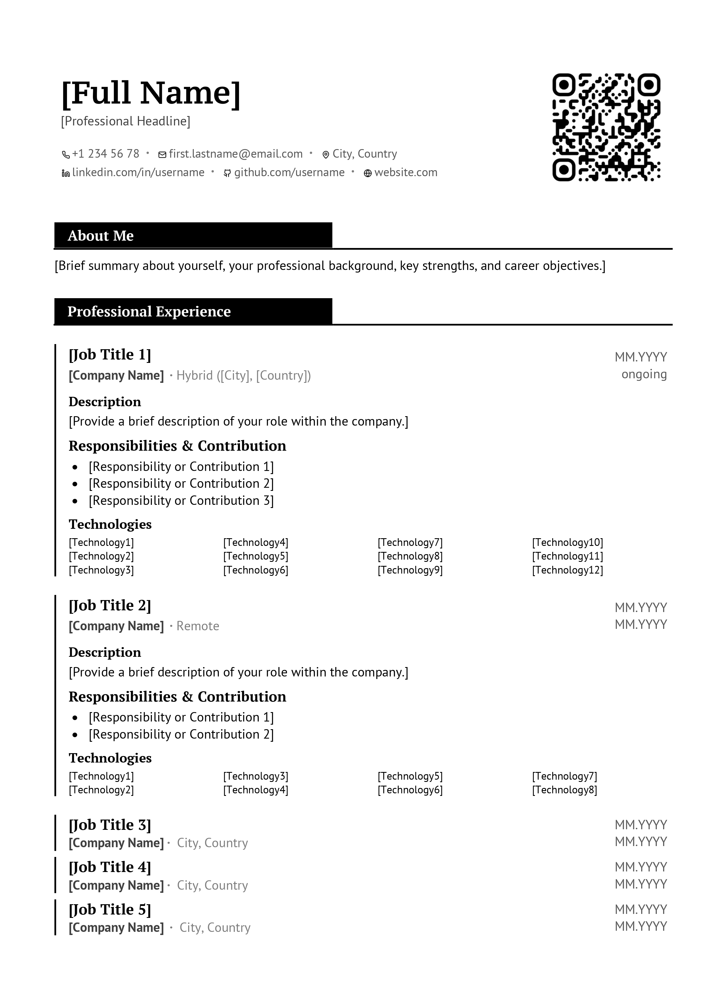
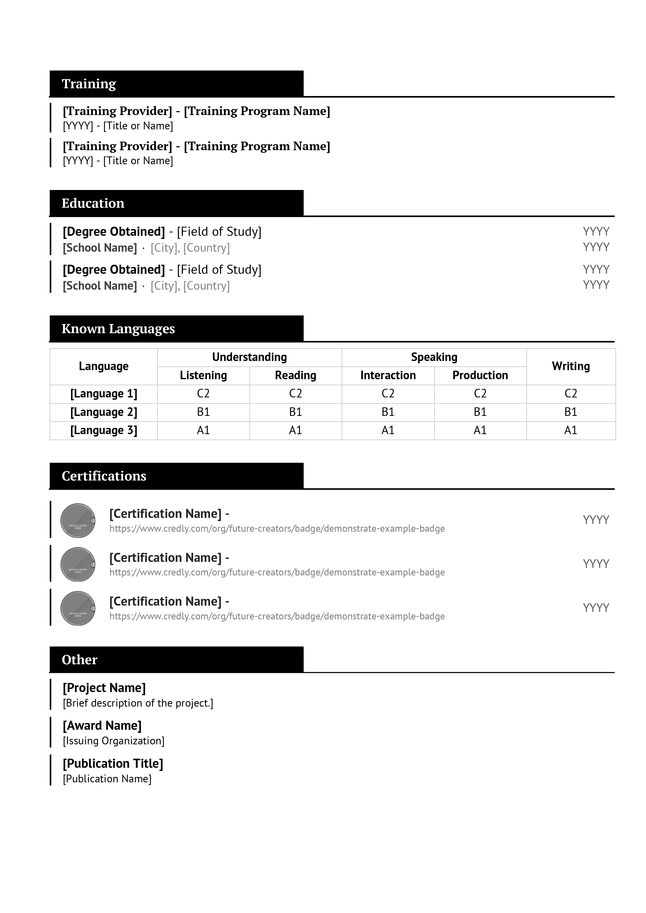
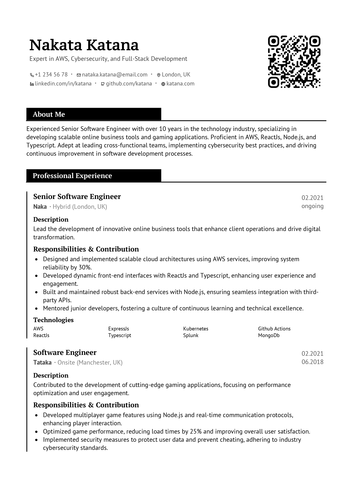
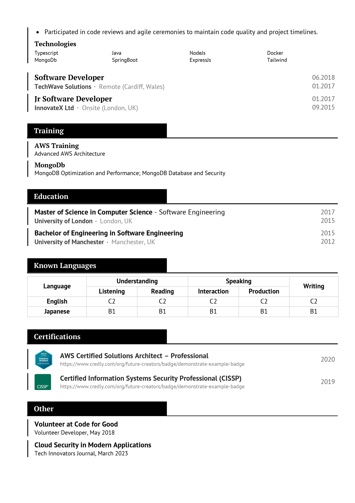
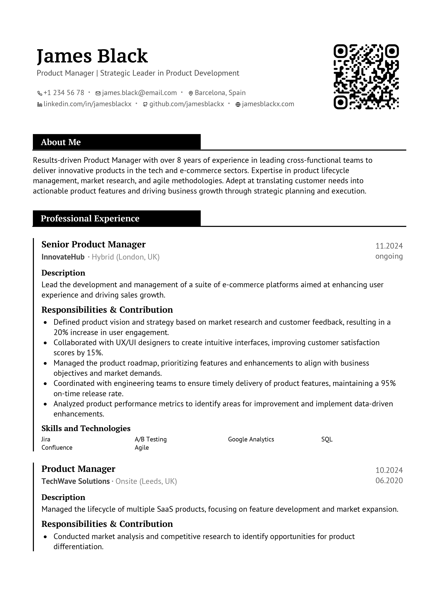
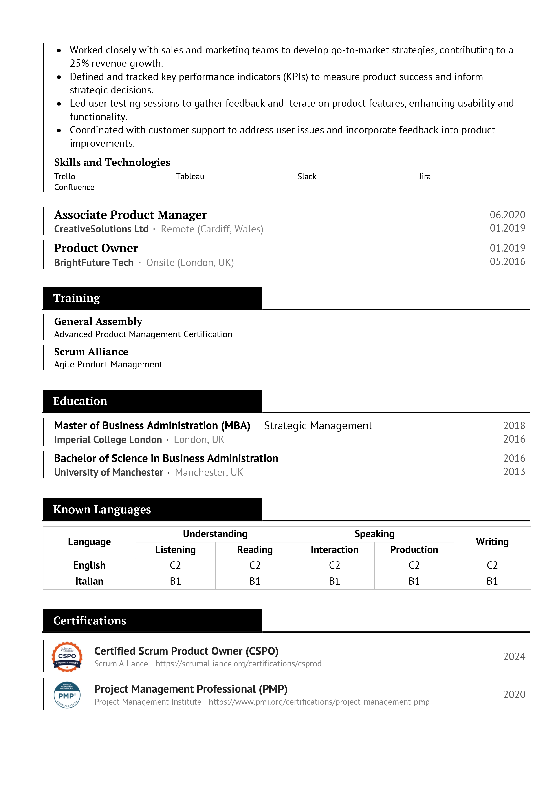

# Naka CV Template

  

Naka is a clean and professional CV template designed to highlight your key details and achievements in previous roles. Whether you're a Software Engineer, Product Manager, or any other professional, Naka helps you present your experience and skills effectively.

## Table of Contents

- [Features](#features)
- [Customization](#customization)
- [Screenshots](#screenshots)

## Features

- **Focused Professional Experience:** Highlight your current and past roles with detailed descriptions, while briefly mentioning older, less relevant positions.
- **About Me Section:** Introduce yourself with a concise "About Me" section at the top of your CV.
- **Contact Information:** Easily add multiple forms of contact information including phone, email, LinkedIn, GitHub, and location.
- **QR Code Integration:** Include a QR code that links to your LinkedIn, GitHub, or any URL of your choice. Generate your QR code using [QR Code Monkey](https://www.qrcode-monkey.com/).
- **Headline Under Name:** Capture attention with a professional headline right below your name.
- **Trainings Section:** Showcase any additional trainings or workshops you've attended.
- **Languages Proficiency:** Display your language skills in an CEFR notation (C1, C2, etc.) using a clear table format.
- **Certifications:** Highlight your certifications with images and links for verification.
- **Other Information:** Add any other relevant information to make your CV stand out.

## Customization

Naka is highly customizable to fit your personal branding:

- **Fonts:** The template uses [PT Sans](https://fonts.google.com/specimen/PT+Sans) for body text and [PT Serif](https://fonts.google.com/specimen/PT+Serif) for headings. You can modify these fonts if desired.
- **Sections:** Add or remove sections as needed to tailor your CV to your profession.
- **Layout Adjustments:** Adjust margins, spacing, and layout elements to better suit your content.

## Screenshots

### Template

### Software Engineer Example

### Product Manager Example

